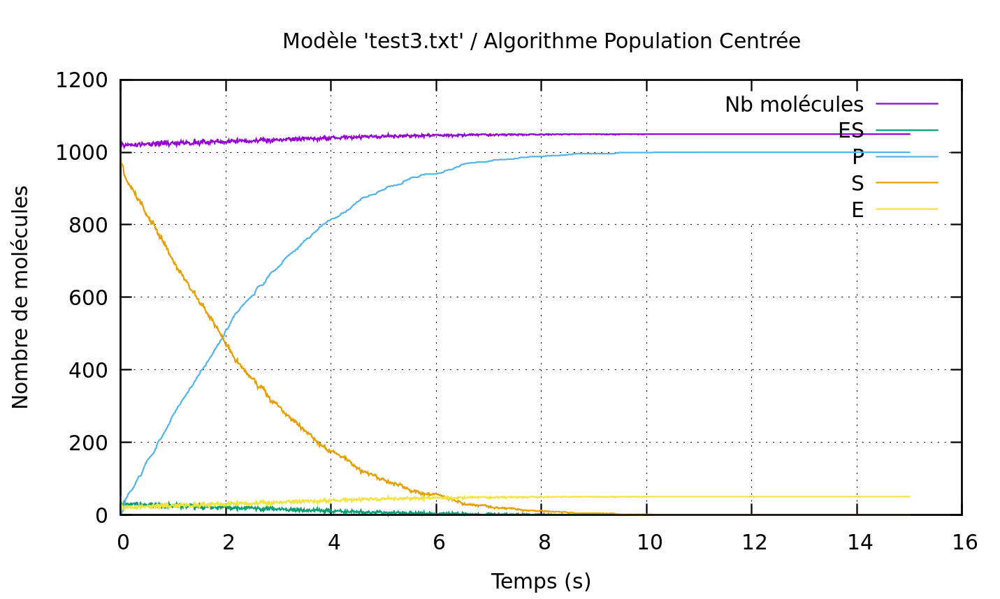
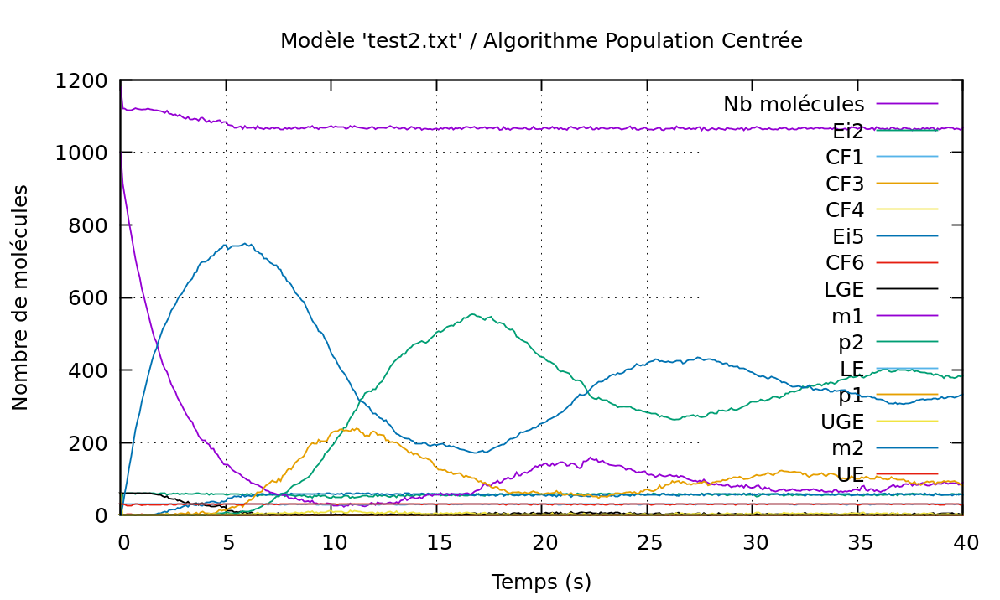

# CMolecule
## Par Alexandre l'Heritier
Simulateur stochastique de réactions biochimiques.

TER proposé par Patrick Amar.

Rendu le 10/05/2020.

## Description

Le principe de ce programme est de simuler les déplacement des molécules et les réactions entre molécule dans une vésicule.

En entrée, on a un fichier qui donne les informations sur les molécules et les réactions possibles entre ces molécules.

En sortie, on a un .csv qui donne la population de chaque type de molécule tous les t temps et un graphique généré par GNUPlot avec le .csv.

Exemple de fichier d'entrée (test3.txt) :
```
espece E, S, P, ES;
diametre = 260;

init(E) = 50;
init(S) = 1000;

E + S -> ES [0.2];
ES -> E + S [0.01];
ES -> E + P [0.001];
```

Exemple de fichier de sortie (test3.txt) :
```
toursSimu;tempsSimu;nbMolecules;ES;P;S;E;
0;0;1050;0;0;1000;50;
100;0.01;1023;27;1;972;23;
200;0.02;1019;31;3;966;19;
300;0.03;1026;24;9;967;26;
400;0.04;1024;26;9;965;24;
500;0.05;1022;28;12;960;22;
600;0.06;1019;31;20;949;19;
700;0.07;1014;36;27;937;14;
800;0.08;1018;32;32;936;18;
900;0.09;1018;32;38;930;18;
1000;0.1;1023;27;45;928;23;
...
```
Exemple GNUPlot (test3.txt) :


Exemple GNUPlot (test2.txt) :


## Programme
### Compilation
Commande pour compiler le programme (nécessite make/flex/bison/g++) :
```
cd code
make
```

### Lancement
Pour accéder à l'aide du programme :
```
./projet_ter -h
```

Pour lancer : 
 - Sur l'exemple 1 [./projet_ter test.txt],
   * la simulation Entité Centrée Parallèle [-1],
   * pendant 1 seconde (10 000 pas) [-t 1],
   * avec un enregistrement des résultats tous les 100 pas (toutes les 0.01 secondes) [-p 100],
   * avec un suivi de la progression [-s],
   * avec les résultats dans le fichier "exemple1.csv" [-v exemple1.csv],
   * avec un affichage final dans gnuplot et le fichier de config gnp "plot_exemple1.csv.gnp" [-g],
   * avec un enregistrement des logs dans le fichier "log_exemple1.txt" [-o log_exemple1.txt] :
```
./projet_ter test.txt -1 -t 1 -p 100 -s -v exemple1.csv -g -o log_exemple1.txt
```

 - Sur l'exemple 2 [./projet_ter test2.txt],
   * la simulation Population Centrée [-2],
   * pendant 40 secondes (400 000 pas) [-t 40],
   * avec un enregistrement des résultats tous les 1000 pas (toutes les 0.1 secondes) [-p 1000],
   * sans suivi de la progression (car ralentit la simulation),
   * avec les résultats dans le fichier "exemple2.csv" [-v exemple2.csv],
   * avec un affichage final dans gnuplot et le fichier de config gnp "plot_exemple2.csv.gnp" [-g],
   * avec un enregistrement des logs dans le fichier "log_exemple2.txt" [-o log_exemple2.txt] :
```
./projet_ter test2.txt -2 -t 40 -p 1000 -v exemple2.csv -g -o log_exemple2.txt
```

 - Sur le exemple 3 [./projet_ter test3.txt],
   * la simulation Population Centrée [-2],
   * pendant 15 secondes (150 000 pas) [-t 15],
   * avec un enregistrement des résultats tous les 100 pas (toutes les 0.01 secondes) [-p 100],
   * sans suivi de la progression (car ralentit la simulation),
   * avec les résultats dans le fichier "exemple3.csv" [-v exemple3.csv],
   * avec un affichage final dans gnuplot et le fichier de config gnp "plot_exemple3.csv.gnp" [-g],
   * avec un enregistrement des logs dans le fichier "log_exemple2.txt" [-o log_exemple3.txt] :
```
./projet_ter test3.txt -2 -t 15 -p 100 -v exemple3.csv -g -o log_exemple3.txt
```
